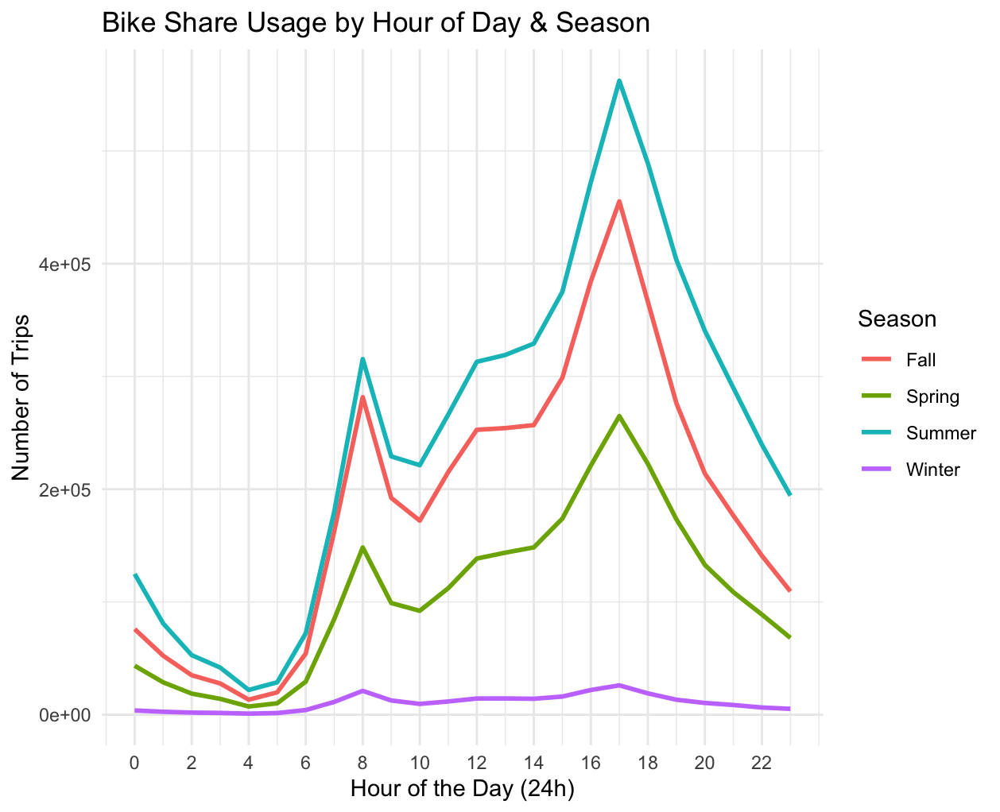
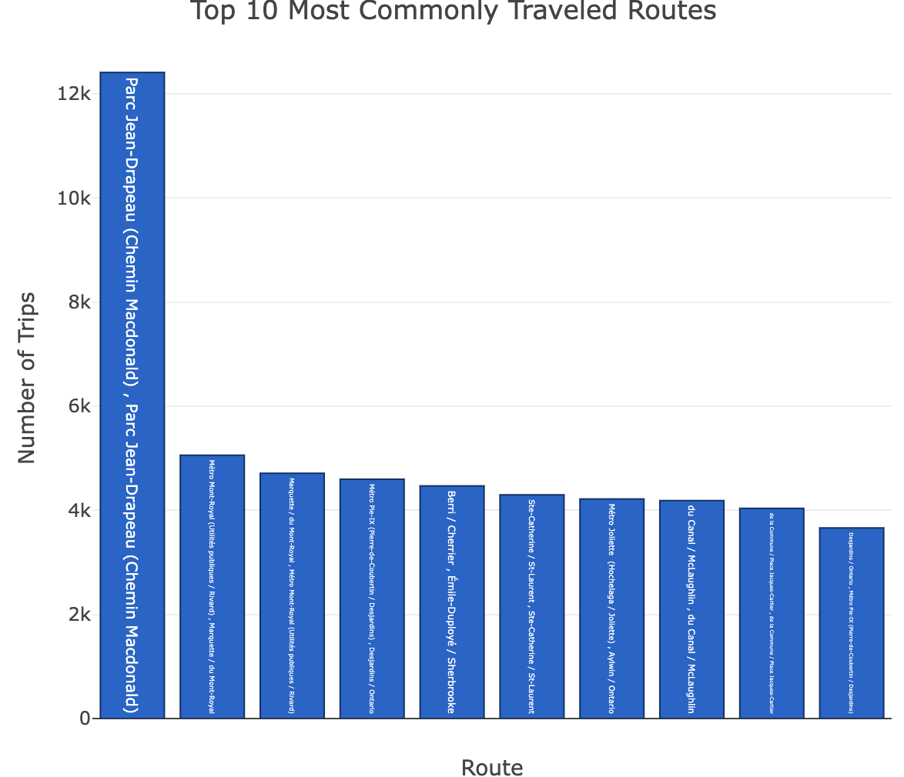
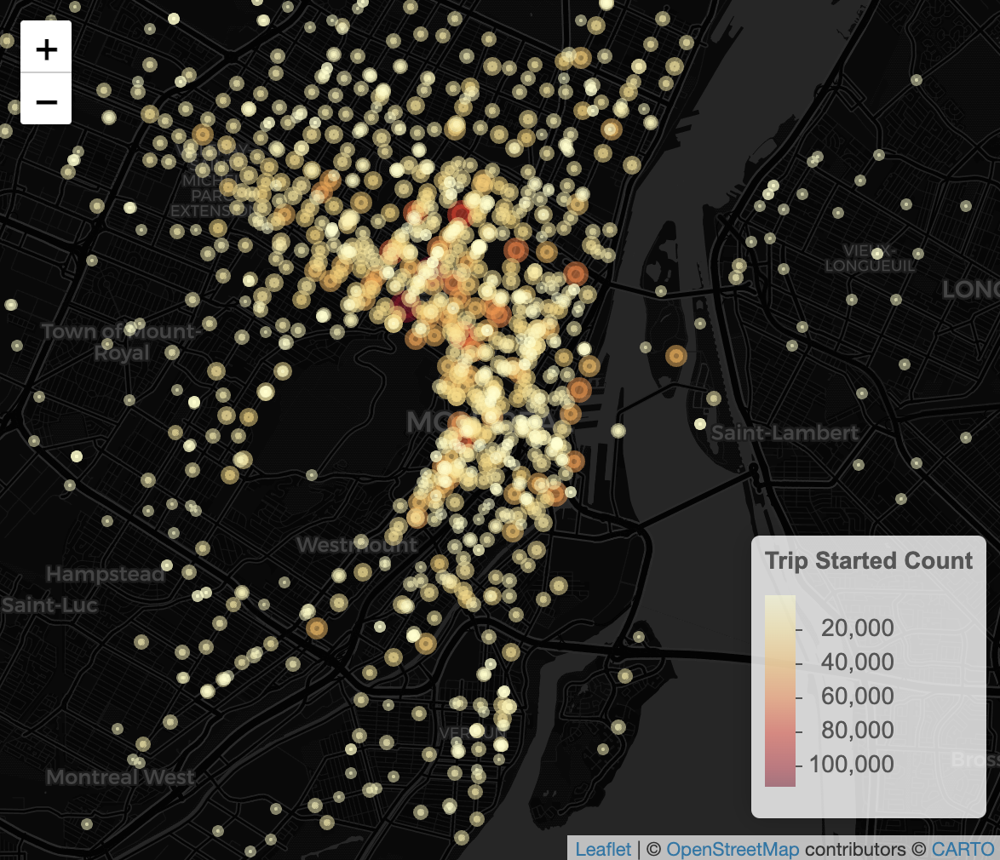

# bixi-geostats

## Summary

This project analyzes Montreal's BIXI bike share system data to uncover usage patterns, popular routes, and station activity. The analysis focuses on temporal patterns across seasons and spatial distribution of rides throughout the city.

## Insights

### Bike Share Usage by Hour of Day & Season

- Summer is the most popular time
- Across seasons, trips peak at 8am and 3pm

### Top 10 Most Common Routes (start station and end station)

- Parc Jean Drapeau to itself is the most popular

### Most Popular Start Stations

## Data Structure

The analysis expects a CSV file with the following key columns:

*STARTTIMEMS*: Trip start time in milliseconds
*STARTSTATIONNAME*: Origin station name
*ENDSTATIONNAME*: Destination station name
*STARTSTATIONLATITUDE*: Origin station latitude
*STARTSTATIONLONGITUDE*: Origin station longitude
